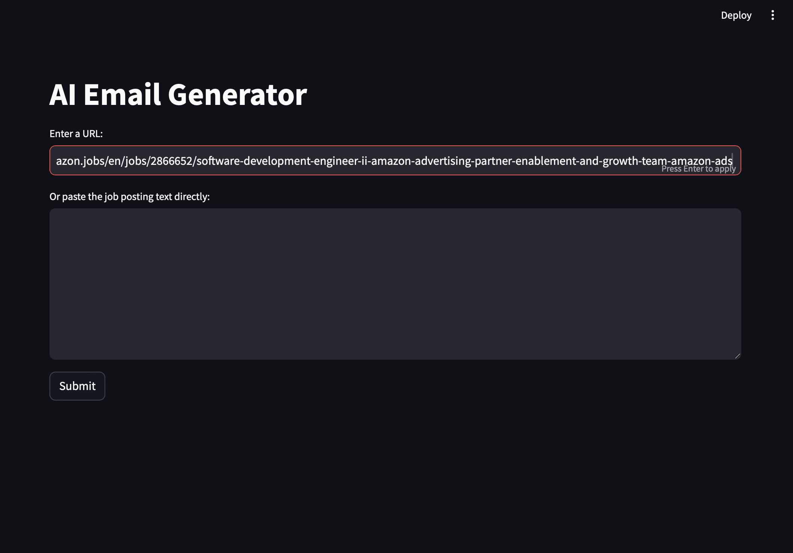

# Cold Email Generator

A dynamic Streamlit-based web application to help generate personalized cold emails tailored to job postings. Users can input a job posting via a URL or paste the job description directly. The application extracts key details, identifies required skills, and uses them to query resources and generate a cold email draft.

---

## Features

- **URL Scraping**: Enter a URL containing job postings to automatically extract relevant job details.
- **Direct Text Input**: Paste job postings directly into a text area for dynamic processing.
- **Skills-Based Querying**: Match required skills to relevant portfolio links.
- **Email Generation**: Generate a cold email draft tailored to the job role and requirements.
- **Dynamic Inputs**: Supports both URL scraping and direct input for maximum flexibility.

---

## Installation

1. **Clone the Repository**
   ```bash
   git repo clone Sarthak2403/AI_Email_Generator
   cd ai_email_generator
   ```

2. **Install Dependencies**
   Ensure you have Python 3.9+ installed. Install the required libraries:
   ```bash
   pip install -r requirements.txt
   ```

3. **Run the Application**
   Launch the Streamlit app:
   ```bash
   streamlit run app/main.py
   ```

4. Open the application in your browser at `http://localhost:8501`.

---

## Usage

1. **Start the Application**: Run the `main.py` script as described above.
2. **Provide Input**:
   - **Option 1**: Enter the URL of a job posting in the input field.
   - **Option 2**: Paste the job posting directly into the text area.
3. **Generate Emails**:
   - Click the **Submit** button to process the input and generate a personalized email draft.
   - View the generated email under the "Generated Email" section.
4. **Copy or Save Emails**: Use the email drafts as templates for cold outreach.

---

## Project Structure

```plaintext
cold-email-generator/
│
├── Outputs              # Outputs of the Program
├── main.py              # Main Streamlit app script
├── chains.py            # Logic for processing job data and email generation
├── portfolio.py         # Portfolio querying logic
├── utils.py             # Helper functions for cleaning and processing data
├── .env #               # Your API KEY
├── requirements.txt     # Dependencies
├── README.md            # Project README file
└── .gitignore           # Git ignored files
```

---

## Key Modules

### `main.py`
- Implements the Streamlit app.
- Handles user input (URL or text).
- Displays generated emails.

### `chains.py`
- Contains the `Chain` class to extract job data and generate email drafts.
- Integrates with an LLM for natural language processing.

### `portfolio.py`
- Queries a portfolio of links/resources based on job skills.
- Ensures email generation is tailored to user expertise.

### `utils.py`
- Cleans and preprocesses input data.
- Handles formatting and utility functions.

---

## Requirements

- **Python**: 3.9+
- **Streamlit**: Framework for creating interactive web apps.
- **LangChain**: Used for document parsing and processing.
- **Other Dependencies**: Listed in `requirements.txt`.

---

## Sample Inputs

### URL Input:
```
https://amazon.jobs/en/jobs/2866652/software-development-engineer-ii-amazon-advertising-partner-enablement-and-growth-team-amazon-ads
```

### Job Posting Input:
```plaintext
Role: Software Development Engineer II  
Experience: 3+ years of non-internship professional software development experience.  
Skills: Design patterns, reliability and scaling, programming, cloud services.  
Description: Lead the architecture, design, and development of product features.
```

---

## Generated Email Example

```markdown
Subject: Application for Software Development Engineer II Role at Amazon

Dear Hiring Manager,

I am excited to apply for the Software Development Engineer II role at Amazon, as advertised. With 3+ years of professional software development experience, I am confident that my skills and expertise align with the requirements of the Partner Enablement and Growth (PEG) team.

As a seasoned software developer, I possess a strong foundation in programming languages such as C, C++, Java, and have also worked with cutting-edge technologies like AI, ML, GenAI, and React. My experience in designing and architecting scalable systems, as well as knowledge of design patterns, reliability, and scaling of new and existing systems, makes me a strong fit for this role.

Throughout my career, I have delivered high-quality results on multiple projects, leveraging my expertise in software development to drive business growth. My proficiency in programming languages, combined with my experience in AI, ML, and software engineering, enables me to tackle complex challenges and develop innovative solutions.

I would like to highlight some of my notable projects, which demonstrate my capabilities:

* https://example.com/ml-python-portfolio (Machine Learning with Python)
* https://example.com/java-portfolio (Java-based projects)
* https://example.com/android-portfolio (Android app development)

These projects showcase my expertise in a range of technologies and my ability to work on diverse projects. I am excited about the opportunity to bring my skills and experience to the PEG team and contribute to the growth and success of Amazon's partners.

Thank you for considering my application. I would welcome the opportunity to discuss my qualifications further and explore how I can contribute to the success of the PEG team.

Best regards,
[Your Name]  
[Your Contact Information]
```

---

## Future Enhancements

- Add multilingual support for global job postings.
- Integrate with LinkedIn for automatic job posting extraction.
- Provide prebuilt templates for different job roles.
- Save and download generated emails in multiple formats.

---

## Outputs

- Starting Page:


- After giving the URL:


- Final Output i.e. the drafted mail:

